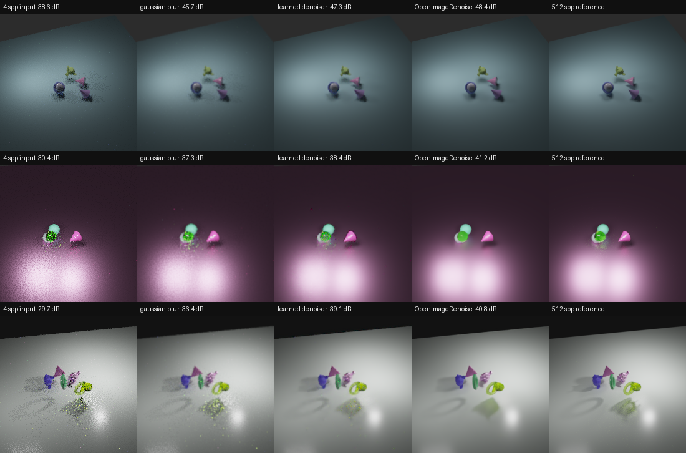
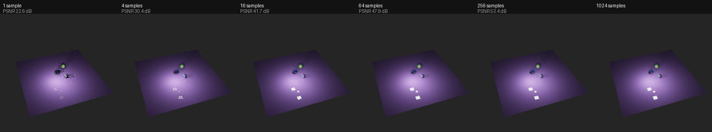
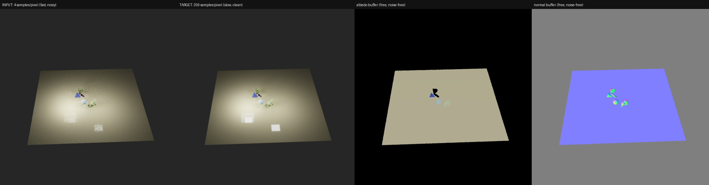

# Learned denoising for path-traced renders

A convolutional denoiser that turns a fast, noisy Monte Carlo render into an
estimate of the slow, converged one. Trained on 300 scenes generated in Blender,
evaluated against Intel's production denoiser.

**On 45 held-out scenes it recovers +7.85 dB, roughly a 6x reduction in render
cost, and lands 2.24 dB short of OpenImageDenoise.**



*Centre crops of three held-out scenes. Left to right: the 4-sample input, a
Gaussian blur baseline, this model, OpenImageDenoise, and the 512-sample
reference.*

## The problem

Path tracing estimates each pixel by firing random light rays and averaging what
they find. It is a statistical estimate, so the image is noisy until enough
samples accumulate. Render time scales linearly with sample count, while noise
falls only as the square root, so each halving of noise costs four times the
compute.



*The same scene at increasing sample counts. Nothing changes but how long the
renderer was allowed to run.*

That curve is why every production renderer ships a denoiser. If a network can
predict the converged image from a cheap one, artists preview in seconds instead
of minutes and final frames render at a fraction of the cost.

## Results

45 held-out scenes, none seen during training. Reproduce with
`./venv/bin/python evaluate.py --run runs/no_aux_norm`.

| method | PSNR | vs input | relMSE |
| --- | --- | --- | --- |
| noisy input (do nothing) | 38.29 dB | | 0.0087 |
| Gaussian blur | 44.17 dB | +5.88 dB | 0.0042 |
| **this model** | **46.14 dB** | **+7.85 dB** | **0.0010** |
| OpenImageDenoise | 48.38 dB | +10.09 dB | 0.0006 |

Because Monte Carlo error falls as 1/N, a PSNR gain converts directly into a
sample count: +7.85 dB is worth about 6x the samples, so a 4-sample render is
made to look like a 24-sample one.

OpenImageDenoise remains 2.24 dB ahead. It is trained on far more data than 300
procedural scenes, by a team, with a larger network. The gap is reported rather
than explained away.

### Gaussian blur is worse than it looks

Blur appears competitive on PSNR, at +5.88 dB. Splitting the error by scene
brightness shows what that number hides:

| brightness band | % of pixels | noisy | blur | this model | OIDN |
| --- | --- | --- | --- | --- | --- |
| very dark (<0.05) | 89.8% | 0.00130 | **0.00269** | 0.00034 | 0.00004 |
| dark (0.05-0.2) | 6.5% | 0.00283 | 0.00213 | 0.00067 | 0.00034 |
| mid (0.2-1) | 3.3% | 0.00511 | 0.00147 | 0.00046 | 0.00022 |
| bright (>1) | 0.5% | 0.00083 | 0.00023 | 0.00006 | 0.00007 |

*relMSE contribution per band.*

In the darkest band, which holds 90% of all pixels, blur is **worse than doing
nothing**: it smears fireflies outward, and a small absolute error in a near-black
pixel is an enormous relative one. PSNR cannot see this, because dark pixels
contribute almost no absolute squared error and the metric is decided by the
brightest 4% of the image.

Both metrics are reported throughout for this reason.

## The ablation: auxiliary buffers did not help

Production denoisers condition on albedo and normal buffers, which the renderer
produces almost free and which are nearly noise-free even at 4 samples. The
expectation was that they would be the single largest quality lever. They were
not.

| | raw inputs | normalised inputs |
| --- | --- | --- |
| with albedo + normal | 44.44 dB | 45.65 dB |
| without them | 45.66 dB | 46.14 dB |
| **effect of the buffers** | **-1.22 dB** | **-0.49 dB** |

Four hypotheses were tested:

1. **A data bug.** Ruled out. Channel layout verified, buffers informative
   (178 distinct albedo colours in a typical view), and measurably near
   noise-free: mean absolute difference from the 512-sample version is 0.0006.
2. **Redundancy.** The noisy render might already reveal surface colour. Ruled
   out. Correlation between the smoothed render and the albedo buffer is 0.41,
   so only 20% of the albedo's variation is already visible.
3. **Overfitting** from the extra input channels. Ruled out, and this was the
   decisive test: the train/held-out gaps are identical, 0.59 dB against 0.58 dB.
   The buffered model was worse on *training* data too, so it was fitting worse
   rather than generalising worse. That redirected the search from "the buffers
   are not useful" to "the network cannot hear them".
4. **Input conditioning.** The surviving explanation. The buffers carry 1.8x and
   2.2x the variance of the log-radiance channels, and in the first convolution
   the highest-variance inputs dominate the activations. Standardising each
   channel using training-set statistics improved both arms and recovered 60% of
   the deficit.

**What remains unresolved:** after normalisation the buffers still cost 0.49 dB,
which is inside the seed-to-seed spread measured across repeated runs (0.37 dB).
At one run per normalised arm that difference cannot be distinguished from noise.
Settling it needs three or more seeds per arm.

The most likely remaining explanation is the dataset rather than the technique.
These scenes are untextured primitives under a few area lights, so material
boundaries are sparse and easy to infer from the render itself. Auxiliary buffers
earn their place on textured, geometrically complex production scenes, which this
dataset does not contain.

## How it works

```
input    4-sample render + albedo + normal   (9 channels, or 3 for the ablation)
   |     log(1+x) compression, per-channel standardisation
   |     U-Net, 3 encoder/decoder levels with skip connections, 1.9M parameters
   |     residual added to the noisy input
   v
output   predicted converged render
```

Decisions worth stating:

- **Residual prediction.** The noisy render is already an unbiased estimate, just
  high variance, so the identity is a reasonable starting point and the network
  only learns the correction.
- **L1 loss in log space.** Monte Carlo noise is heavy-tailed: fireflies carry
  values hundreds of times the image mean. Squaring the error lets a handful of
  pixels dominate every gradient. L1 in log space keeps both bright outliers and
  dark regions in proportion.
- **Metrics on tonemapped images.** PSNR on linear HDR spreads 22.7 dB between
  scenes in this dataset against 12.9 dB tonemapped, because the per-scene peak
  varies 62x. Neither is scene-independent, so methods are only ever compared on
  identical held-out views, where that dependence cancels.

## Data generation



*What each training example contains: the noisy input, the converged target, and
the two auxiliary buffers the renderer produces almost free.*

`blender/render_dataset.py` drives Blender headless, rendering each scene twice: 4
samples for the input and 512 for the target, plus albedo and normal buffers.

Four decisions there are load-bearing:

- **Cycles' own denoiser is off for both renders.** A denoised target would train
  the network to imitate OpenImageDenoise rather than the converged image, and
  would remove OIDN as an honest baseline.
- **Auxiliary buffers come from the noisy render.** At inference only the cheap
  render exists, so taking them from the converged one would leak information the
  deployed system never has.
- **Both halves share a seed and camera**, so the pair is pixel aligned. Verified:
  96.6% of pixels are identical between them, and the differences are edge
  anti-aliasing from partial pixel coverage.
- **View transform set to Raw**, so the EXR files hold linear radiance rather
  than a tone-mapped approximation of it.

## Methodology

- **Splits are by scene, never by tile.** Each 512px render yields sixteen 128px
  tiles sharing a scene, camera and lighting. Mixing a scene's tiles across the
  split would let the network memorise it and score well on effectively the same
  image. 255 train / 45 held out.
- **The blur baseline is tuned on training data.** Its sigma is selected on the
  training views and applied unchanged to the held-out ones, the same discipline
  the network is held to. Choosing it by reading off test scores would inflate it.
- **Normalisation statistics come from training views only**, so nothing about
  the held-out set reaches the model.

## Limitations

- **Single-frame only.** Applied per frame of an animation this would flicker,
  because it makes slightly different guesses each frame, and flicker reads as
  worse than noise. Production denoisers use motion vectors to reuse the previous
  frame. Not implemented.
- **Procedural scenes only.** Untextured primitives under area lights. No
  textures, no complex materials, no interiors, no participating media. This is
  the most likely reason the auxiliary-buffer ablation came out as it did.
- **One seed per normalised arm.** The residual -0.49 dB buffer effect is not
  distinguishable from run-to-run variance.
- **Trained and evaluated at 4 samples per pixel.** Behaviour at other sample
  counts is untested.

## Setup

Requires Python 3.13 and Blender 5.x.

```bash
python3 -m venv venv
./venv/bin/pip install -r requirements.txt
```

Generate the dataset (about 15 minutes on an M3):

```bash
/Applications/Blender.app/Contents/MacOS/Blender --background --python blender/render_dataset.py -- \
    --out data/raw --views 300 --noisy-spp 4 --clean-spp 512 --resolution 512 --procedural
```

Optionally add the OpenImageDenoise baseline, which replays the identical scenes
with Cycles' denoiser enabled:

```bash
/Applications/Blender.app/Contents/MacOS/Blender --background --python blender/render_dataset.py -- \
    --out data/raw --views 300 --noisy-spp 4 --resolution 512 --procedural --oidn
```

Then train and evaluate:

```bash
./venv/bin/python train.py --epochs 60 --normalise --no-aux --out runs/no_aux_norm
./venv/bin/python evaluate.py --run runs/no_aux_norm
./venv/bin/python figures.py --run runs/no_aux_norm --zoom 220
```

## Tests

```bash
./venv/bin/python -m pytest
```

50 tests. The fast ones need no data, no GPU and no network; the rest read the
rendered dataset. They cover the metrics, the split logic, the log-space
transforms and the model's invariants, on the principle that a silent error in
any of those would look like a model that simply underperforms.

## Project structure

```
.
├── train.py                     entry points, thin wrappers over the package
├── evaluate.py
├── figures.py
│
├── blender/
│   └── render_dataset.py        scene generation and rendering
│
├── denoiser/
│   ├── data.py                  EXR loading, splits, metrics
│   ├── dataset.py               PyTorch datasets over the cached renders
│   ├── model.py                 U-Net, log-space transforms, normalisation
│   ├── train.py                 training loop
│   ├── evaluate.py              baselines and comparison
│   └── figures.py               figure generation
│
├── data/raw/                    rendered scenes (gitignored, ~750 MB)
├── runs/                        training histories, and gitignored checkpoints
├── docs/                        figures used above
└── tests/                       50 tests
```

`blender/` is separate on purpose. That script runs inside Blender's own Python
interpreter, so it cannot import `denoiser/` and does not see this project's
virtual environment. Everything else runs in the venv. Keeping the two apart
makes the boundary visible rather than something to rediscover when an import
fails.
